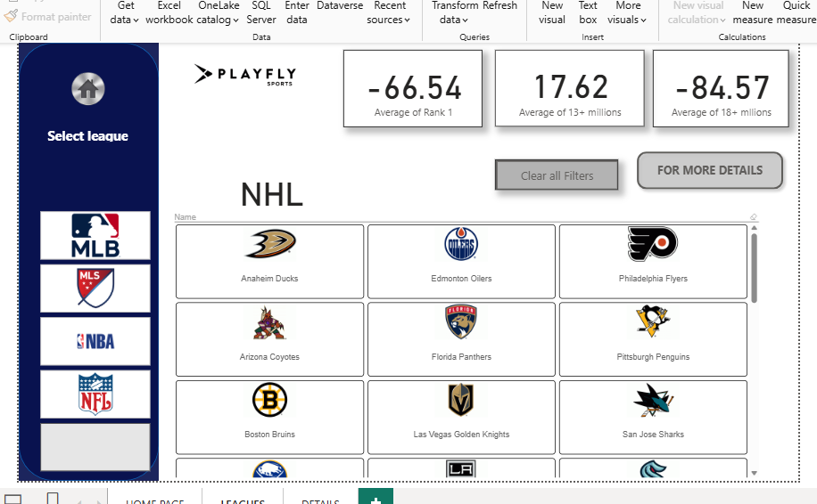

# Playfly-Sports-Dashboard
This repository holds the Playfly Sports Power BI Dashboard. It's a dynamic and interactive tool for analyzing sports data across the MLB, NBA, MLS, and NFL. The project features a user-friendly design, custom DAX measures, and interactive filters, providing actionable insights for sports enthusiasts and analysts.A data visualization dashboard for Playfly, a leading sports marketing and media company. This project provides a comprehensive and interactive view of key performance indicators (KPIs) to help stakeholders understand and optimize fan engagement, audience reach, and monetization strategies.

Overview
The Playfly Dashboard is designed to be a central hub for all data-driven insights. It aggregates data from various sports properties and campaigns, transforming raw numbers into intuitive charts and graphs. The dashboard is tailored to support a "Fan-Focused, Data-Driven" approach, enabling quick and informed decision-making.

Key Features
Fan Engagement Metrics: Visualize user interactions, social media engagement, and real-time fan activity across different platforms.

Audience & Reach Analytics: Monitor and measure the reach of sports content and campaigns, with breakdowns by demographics, geography, and platform.

Monetization Tracking: Track revenue streams, sponsorship performance, and ad impression data to optimize commercial strategies.

Historical Data & Trends: Analyze long-term performance with historical data to identify trends, seasonal patterns, and campaign effectiveness.

Interactive Visualizations: Use interactive charts, graphs, and filters to drill down into specific data points and gain deeper insights.

Screenshots
The following images provide a glimpse into the dashboard's user interface and its key data visualizations.

Dashboard Overview

Detailed Analytics

Revenue & Performance Metrics

How to Use
The dashboard is designed for easy access and navigation. Simply log in to the application to view the latest data. Use the sidebar to switch between different data views and the interactive filters to customize your analysis.

Acknowledgements
This dashboard was developed for Playfly to support their mission of providing innovative, digitally-enabled solutions to the sports industry.

